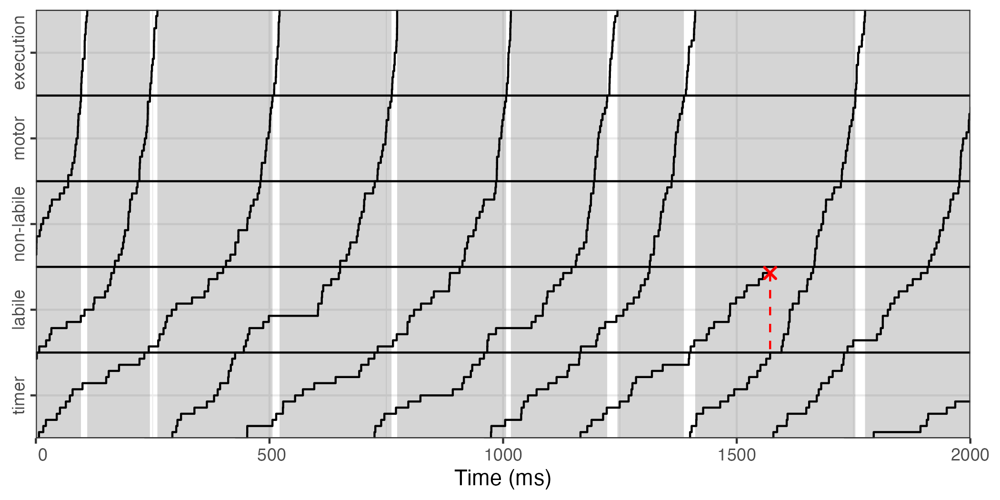
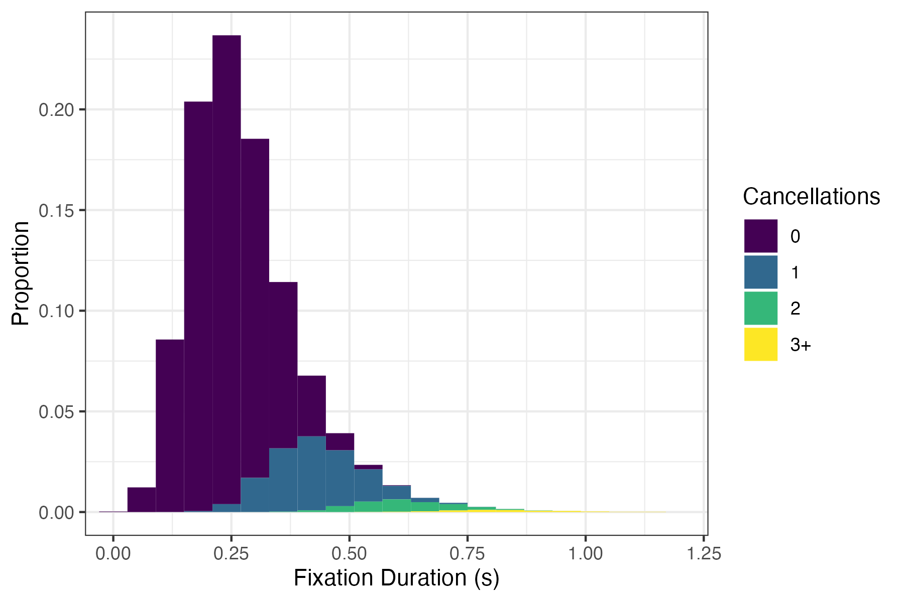
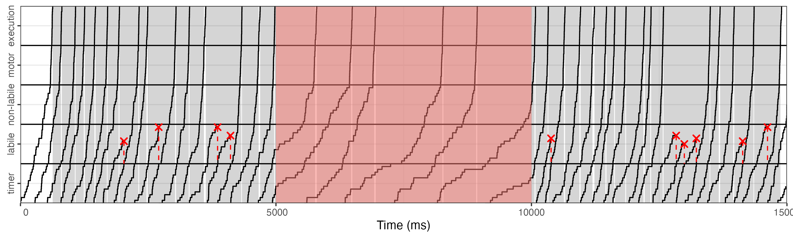
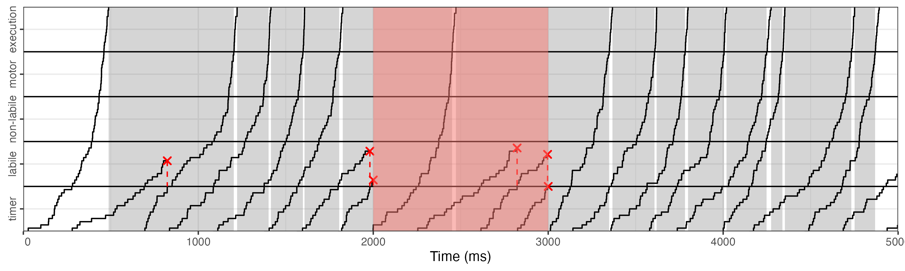

# mw-fixation-duration
A model of fixation durations during mind-wandering.


 - `UCM.R`: utility functions for simulating the UCM of fixation duratinos
 - `UCM-demo.R`: a demonstration of how to use the functions in `UCM.R`, shown below:


# Simulating fixation durations with the UCM model in R

## Introduction

This file demonstrates how to use the UCM model contained in the file
`UCM.R`. This implementation of the model was written with the `simmer`
package in `R`, which is a discrete event simulator. First, let’s load
some packages, load the source code for the UCM utility functions, and
set a seed so that our results are reproducible:

``` r
library(simmer)
library(dplyr)
library(tidyr)
library(ggplot2)
library(parallel)
library(viridis)

## Load the UCM source code
source('UCM.R')
set.seed(1234)
```

## Simulating a single trial using UCM

First, we can run UCM for five seconds with the default parameter
settings:

``` r
ucm <- UCM() %>%
    run(until=5)

ucm
```

    ## simmer environment: anonymous | now: 5 | next: 5.0138453616531
    ## { Monitor: in memory }
    ## { Source: init. | monitored: 1 | n_generated: 1 }
    ## { Source: timer. | monitored: 2 | n_generated: 21 }
    ## { Source: labile. | monitored: 2 | n_generated: 20 }
    ## { Source: nonlabile. | monitored: 2 | n_generated: 16 }
    ## { Source: motor. | monitored: 2 | n_generated: 16 }
    ## { Source: execution. | monitored: 2 | n_generated: 16 }
    ## { Source: fixation. | monitored: 2 | n_generated: 16 }

As we can see, the current time of the simulator (now) is now 5 seconds,
and the next event occurs at 5.01 seconds. This output also tells us
that the timer has cycled 21 times, 20 of which made it to the labile
stage, and 16 of which continued to saccade execution.

To get more detailed information, we can use the function `get_states`,
which returns a dataframe detailing the time of every state transition
in the model. The `stage` column tells us whether the transition
happened in the timer, the labile stage, the non-labile stage, the motor
planning stage, or saccade execution. The `n` column tells you how many
walks completed this stage at this point in time, and the `id` column is
a unique identifier linking random walks between stages. The `state`
column tells us which state the model transitioned to at that point in
time (from 0 to N-1), and `cum_state` carries the same information
except that each stage starts a state above the previous stage, which is
useful for plotting. Finally, the `replication` column tells us which
instance of the UCM this state transition pertains to. Since we only ran
one instance, `replication` is always 1.

``` r
get_states(ucm)
```

    ## # A tibble: 1,240 × 7
    ##      time stage n     replication state cum_state    id
    ##     <dbl> <fct> <chr>       <int> <dbl>     <dbl> <dbl>
    ##  1 0      timer 0               1     0         0     1
    ##  2 0.0447 timer 0               1     1         1     1
    ##  3 0.0491 timer 0               1     2         2     1
    ##  4 0.0492 timer 0               1     3         3     1
    ##  5 0.0803 timer 0               1     4         4     1
    ##  6 0.0872 timer 0               1     5         5     1
    ##  7 0.0888 timer 0               1     6         6     1
    ##  8 0.104  timer 0               1     7         7     1
    ##  9 0.107  timer 0               1     8         8     1
    ## 10 0.122  timer 0               1     9         9     1
    ## # … with 1,230 more rows

To get information about the model’s simulated fixations, we can use the
function `get_fixations`. The `id`, `n`, and `replication` columns are
the same as before. We also have columns telling us the `start_time`,
the `end_time`, and the `duration` of every fixation the model has made.

``` r
get_fixations(ucm)
```

    ## # A tibble: 15 × 6
    ##       id n     replication start_time end_time duration
    ##    <dbl> <chr>       <int>      <dbl>    <dbl>    <dbl>
    ##  1     1 0               1      0.568     1.01   0.437 
    ##  2     3 1               1      1.03      1.22   0.189 
    ##  3     4 2               1      1.24      1.62   0.379 
    ##  4     7 3               1      1.64      1.95   0.305 
    ##  5     8 4               1      1.97      2.19   0.220 
    ##  6     9 5               1      2.21      2.30   0.0942
    ##  7    10 6               1      2.32      2.69   0.369 
    ##  8    11 7               1      2.71      3.10   0.389 
    ##  9    12 8               1      3.12      3.23   0.116 
    ## 10    13 9               1      3.25      3.55   0.297 
    ## 11    14 10              1      3.56      3.77   0.207 
    ## 12    15 11              1      3.79      4.06   0.268 
    ## 13    16 12              1      4.07      4.32   0.248 
    ## 14    17 13              1      4.34      4.53   0.189 
    ## 15    18 14              1      4.55      4.77   0.221

To get information about which saccade program cancellation, we can use
the function `get_cancellations`. The `id` and `replication` columns are
the same as before. The `cancelled` column tells us whether the saccade
program with this `id` was cancelled (1) or not (0). Finally,
`n_cancellations` tells us how many saccade programs were cancelled
during the fixation with this `id`. `n_cancellations` is 0 for all
cancelled saccade programs.

``` r
get_cancellations(ucm)
```

    ## # A tibble: 20 × 4
    ##       id replication cancelled n_cancellations
    ##    <dbl>       <int>     <dbl>           <dbl>
    ##  1     1           1         0               1
    ##  2     2           1         1               0
    ##  3     3           1         0               0
    ##  4     4           1         0               2
    ##  5     5           1         1               0
    ##  6     6           1         1               0
    ##  7     7           1         0               0
    ##  8     8           1         0               0
    ##  9     9           1         0               0
    ## 10    10           1         0               0
    ## 11    11           1         0               0
    ## 12    12           1         0               0
    ## 13    13           1         0               0
    ## 14    14           1         0               0
    ## 15    15           1         0               0
    ## 16    16           1         0               0
    ## 17    17           1         0               0
    ## 18    18           1         0               0
    ## 19    19           1         0               0
    ## 20    20           1         0               0

We can also easily get a nifty plot of the UCM’s state through time:

``` r
trace_plot(ucm)
ggsave('plots/UCM-trace.png', width=10, height=3)
```



## Custom parameter settings

We’re also not limited to the default parameter settings. We can set
custom parameters like so:

``` r
ucm <- UCM(N_timer=15, t_timer=.3,
           N_labile=20, t_labile=.2,
           N_nonlabile=20, t_nonlabile=.05,
           N_motor=30, t_motor=.02,
           N_execution=30, t_execution=.015) %>%
    run(until=5)

trace_plot(ucm)
ggsave('plots/UCM-trace2.png', width=10, height=3)
```


## Simulating many trials in parallel

Thankfully, `simmer` makes it easy to run multiple instances of the
`UCM` in parallel with the function `parallel::mcapply`. Depending on
how many cores you have on your machine, though, this could take a
minute or two. Also note that we need to use the `wrap` function, which
ensures that our simulation data is available after the parallel
processes are complete.

``` r
## set the number of cores
options(mc.cores=parallel::detectCores())

## run 1000 trials, each lasting 30s, in parallel
ucms <- mclapply(1:1000, function (i) {
    UCM() %>%
        run(until=30) %>%
        wrap()
})

head(ucms, n=3)
```

    ## [[1]]
    ## simmer environment: anonymous | now: 30 | next: 30.0093411920058
    ## { Monitor:  }
    ## { Source: init. | monitored: 1 | n_generated: 1 }
    ## { Source: timer. | monitored: 2 | n_generated: 122 }
    ## { Source: labile. | monitored: 2 | n_generated: 121 }
    ## { Source: nonlabile. | monitored: 2 | n_generated: 99 }
    ## { Source: motor. | monitored: 2 | n_generated: 99 }
    ## { Source: execution. | monitored: 2 | n_generated: 99 }
    ## { Source: fixation. | monitored: 2 | n_generated: 99 }
    ## 
    ## [[2]]
    ## simmer environment: anonymous | now: 30 | next: 30.0011336141098
    ## { Monitor:  }
    ## { Source: init. | monitored: 1 | n_generated: 1 }
    ## { Source: timer. | monitored: 2 | n_generated: 116 }
    ## { Source: labile. | monitored: 2 | n_generated: 115 }
    ## { Source: nonlabile. | monitored: 2 | n_generated: 94 }
    ## { Source: motor. | monitored: 2 | n_generated: 94 }
    ## { Source: execution. | monitored: 2 | n_generated: 94 }
    ## { Source: fixation. | monitored: 2 | n_generated: 94 }
    ## 
    ## [[3]]
    ## simmer environment: anonymous | now: 30 | next: 30.016297300884
    ## { Monitor:  }
    ## { Source: init. | monitored: 1 | n_generated: 1 }
    ## { Source: timer. | monitored: 2 | n_generated: 122 }
    ## { Source: labile. | monitored: 2 | n_generated: 121 }
    ## { Source: nonlabile. | monitored: 2 | n_generated: 95 }
    ## { Source: motor. | monitored: 2 | n_generated: 95 }
    ## { Source: execution. | monitored: 2 | n_generated: 95 }
    ## { Source: fixation. | monitored: 2 | n_generated: 95 }

As you can see, `ucms` is a list containg 1000 instances of the UCM. We
can use the same functions as before on this list to, say, make a
histogram of fixation durations as a function of the number of
cancellations within the fixation:

``` r
cancellations_hist(ucms, max_cancellations=3)
ggsave('plots/UCM-cancellations.png', width=6, height=4)
```



## Local Rate Modulation

Since `UCM` is implemented with the `simmer` package, it is painless to
add more events to our simulator. One useful example is in local rate
modulation, where you want to speed up or slow down the random walks of
the timer, the labile stage, and the non-labile stage for some period of
time. To do so, we first need to define a `simmer` trajectory which
specifies when and how long to modulate the walk rate. The UCM responds
to the global attribute `"modulation"`, which can be modified using the
`simmer` command `set_global`. For instance, the following code says
that we want to reduce the rate by a factor of 4 for a duration of five
seconds, then resume at the normal rate:

``` r
modulation <- trajectory() %>%
    set_global("modulation", 0.25) %>%
    timeout(5) %>%
    set_global("modulation", 1)
```

Next, we can run the UCM as before, but this time we add a `simmer`
generator for our modulation trajectory, starting at five seconds.
Including the argument `mon=2` tells `simmer` to log the modulation
events we defined above in case we need it for later.

``` r
ucm <- UCM() %>%
    add_generator('mod.', modulation, at(5), mon=2) %>%
    run(until=15)
```

To demonstrate how this alters the model’s behavior, we can make a trace
plot as before, adding a shaded area to highlight the period of
modulation:

``` r
trace_plot(ucm) +
    geom_rect(aes(xmin=5, xmax=10, ymin=-Inf, ymax=Inf, fill='modulation'),
              data=data.frame(), inherit.aes=FALSE, alpha=0.5, show.legend=FALSE)
ggsave('plots/UCM-local-modulation.png', width=10, height=3)
```



## Local Cancellation

The other major case where we need to augment the simulator with
additional information is when we want to model local cancellation of
saccade programs, for instance when a stimulus disappears for a
duration. To model this, we can create a trajectory which logs the state
of the stimulus using the global attribute `"stimulus"` (1 is on and 0
is off). Then to make the appearance and disappearance of the stimulus
cancel any labile saccade programs, we can use the `simmer` command
`send('cancel-labile')`, which broadcasts a signal that saccade programs
in the labile stage listen to:

``` r
stimulus <- trajectory() %>%
    set_global("stimulus", 0) %>% ## turn off the stimulus
    send('cancel-labile') %>%     ## cancel any labile programs
    timeout(1) %>%
    set_global("stimulus", 1) %>% ## turn on the stimulus
    send('cancel-labile')         ## cancel any labile programs
```

Then as before, we simply create an instance of the UCM, add a generator
to initialize the starting state of the stimulus to on, add a generator
to turn off the stimulus after two seconds, and run the model:

``` r
ucm <- UCM() %>%
    add_generator('stim.', trajectory() %>% set_global('stimulus', 1), at(0)) %>%
    add_generator('stim-off.', stimulus, at(2), mon=2) %>%
    run(until=5)

trace_plot(ucm) +
    geom_rect(aes(xmin=2, xmax=3, ymin=-Inf, ymax=Inf, fill='modulation'),
              data=data.frame(), inherit.aes=FALSE, alpha=0.5, show.legend=FALSE)
ggsave('plots/UCM-local-cancellation.png', width=10, height=3)
```



## Conclusions

Hopefully this gives you a good idea of how to simulate fixation
durations using the UCM model. If you have any questions, feel free to
reach out at <kevin.oneill@duke.edu>.
